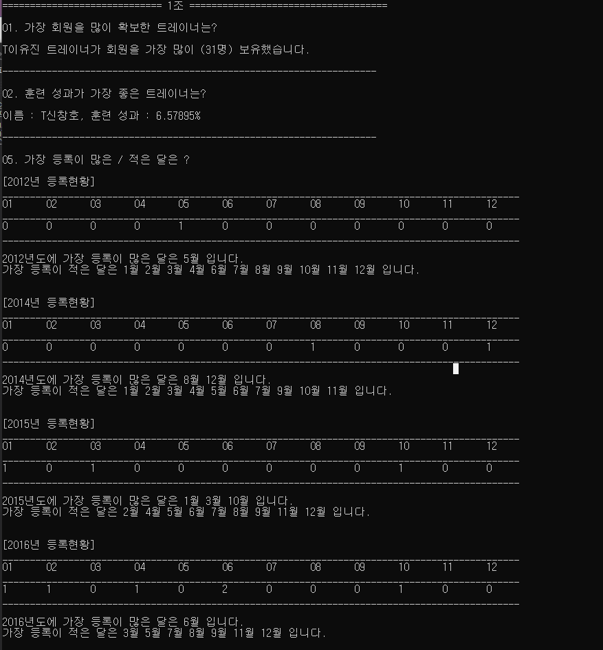
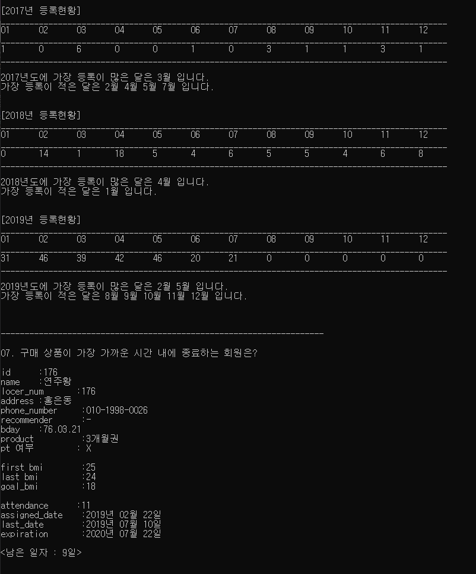
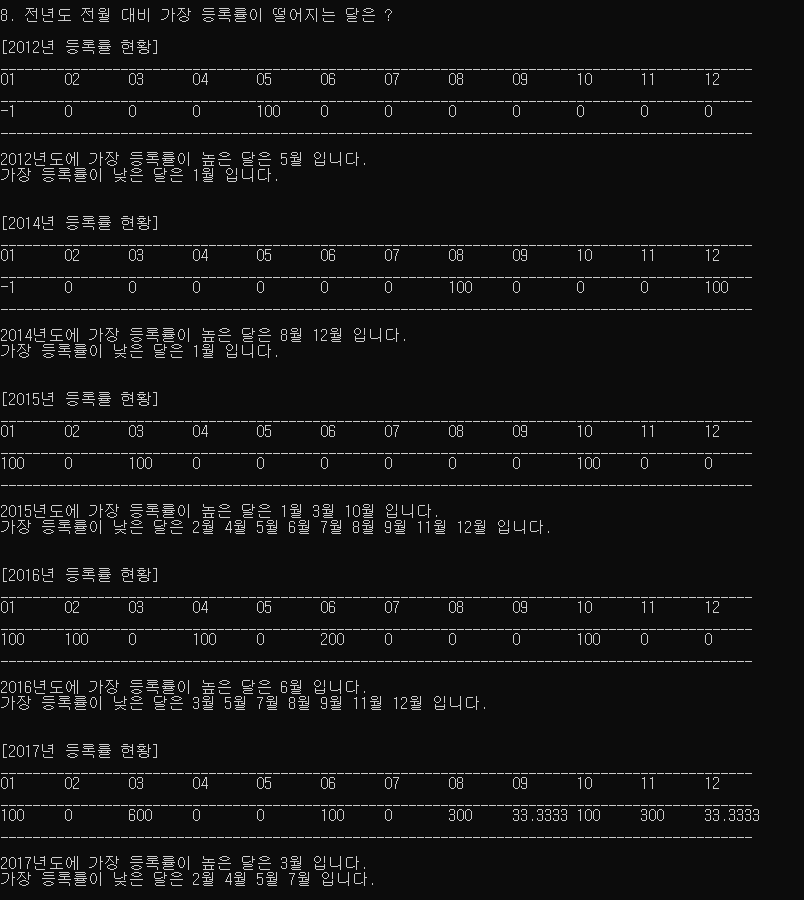
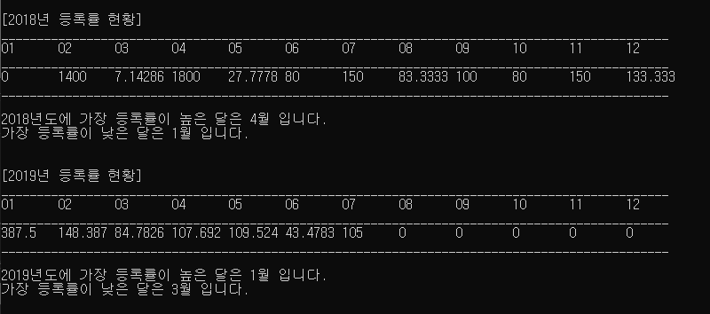
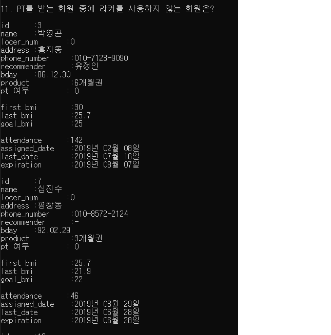
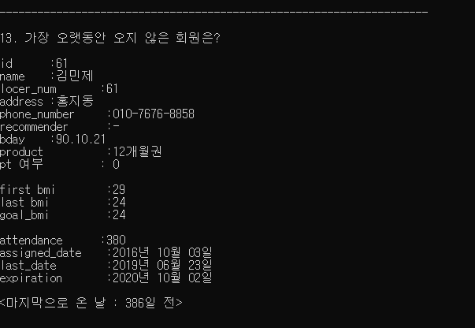

# DataStructure_projec

제공된 데이터를 이용하여 주어진 문제를 해결한다.
이때, 가장 합리적인 자료구조를 이용하여 문제를 해결한다.

- 제공된 데이터
cvs 파일로 제공되며, 예시는 아래와 같다.

이름 | 주거지 | 	전화번호| 추천인 |	생년월일| 구매상품 | PT 등록 여부 |	담당 트레이너 |	첫 BMI 지수 |	현재 BMI지수 |	목표 BMI 지수	| 사용 라커	| 최초 등록일 | 누적 운동 횟수 |	누적 PT 횟수 |	가장 최근 운동일 |	상품권 말소 시기
------ | -----| -------------- | ----- | -------- | ------- | -- | -- | --- | --- | ---- | -- | ---------------- | -- | ---- | ------------ | ----------------
유연수 |	홍지동 |	010-2019-1711 |	유정인 |	95.03.15 |	6개월권 |	N |	- |	27.5 |	25 |	20 |	1 |	2019년 05월 01일 |	25 |	0 | 2019년 06월 30일 |	2019년 07월 31일

데이터의 개수는 알수없으며 정해진 규칙에 맞게 정리되어있다.

- 문제

번호 | 내용
---- | -----------------------------------------
01 | 가장 회원을 많이 확보한 트레이너는?
02 | 가장 훈련 성과가 좋은 트레이너는?
05 | 가장 등록이 많은 / 적은 달은?
07 | 구매 상품이 가장 가까운 시간 내에 종료하는 회원은?
08 | 전월대비 가장 등록률이 떨어지는 달은?
11 | PT를 받는 회원 중에 라커를 이용하지 않는 회원은?
13 | 가장 오랫동안 오지 않은 회원은?
16 | 운동 달성률이 가장 높은/낮은 회원은?
19 | PT를 가장 많이 / 적게 이용하는 연령대는?

- 출력내용

## Contributor
- 컴퓨터과학과 이유진
- 컴퓨터과학과 염지현
- 전기공학과 조대훈
- 컴퓨터과학과 윤정연
